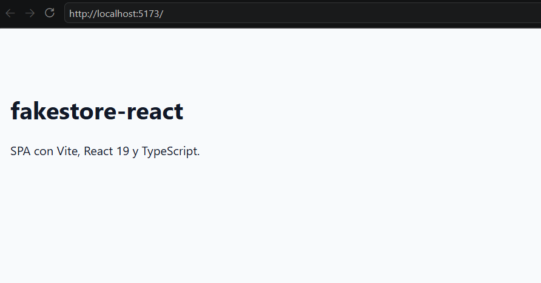
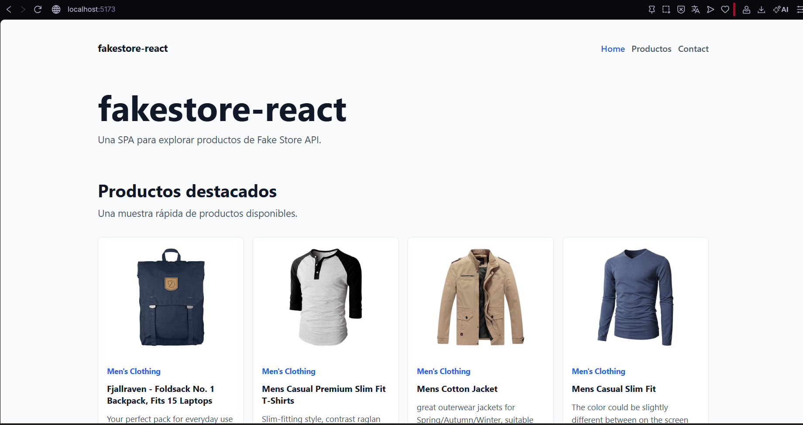

# fakestore-react

SPA desarrollada con **Vite + React 19 + TypeScript** para consumir productos desde la API publica de Fake Store.

## Autor

Junior Cueva Fabian

## Descripcion

Este proyecto muestra una tienda basica de productos usando una API publica.  
La aplicacion permite navegar entre paginas, visualizar productos, ver productos destacados en Home y agregar o quitar productos de favoritos usando `localStorage`.

## Tecnologias usadas

- React 19
- Vite
- TypeScript
- React Router
- Axios
- Shadcn UI
- Tailwind CSS
- LocalStorage
- Vercel

## API utilizada


https://fakestoreapi.com/products

## LEVANTAMOS NUESTRO PROYECTO 


## AGREGAMOS RUTAS PRINCIPALES : home-products-contct


## CONSUMIMOS EL API


## MUESTRA DE PRODUCTOS DESTACADOS EN EL HOME 


## AGREGAMOS EL APARTADO AGREGAR  FAVORITO  DENTRO DEL PRODUCTO 


## PASOS PARA EJECUTAR EL PROYECTO 

```text
Instalacion
Clonar el repositorio:

git clone URL_DEL_REPOSITORIO
Entrar al proyecto:

cd fakestore-react
Instalar dependencias:

npm install
Ejecutar en desarrollo:

npm run dev