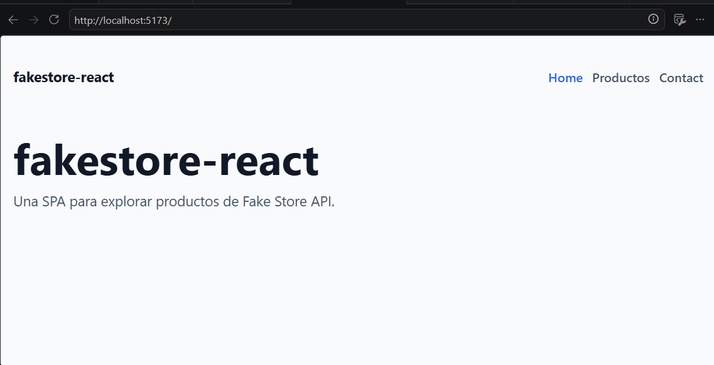
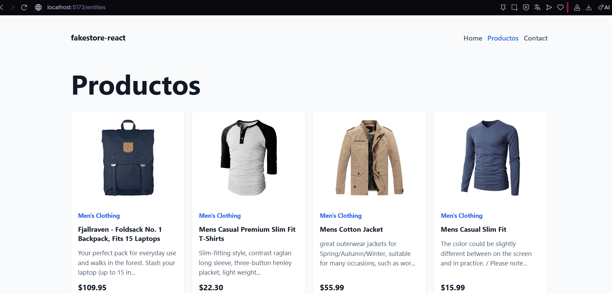
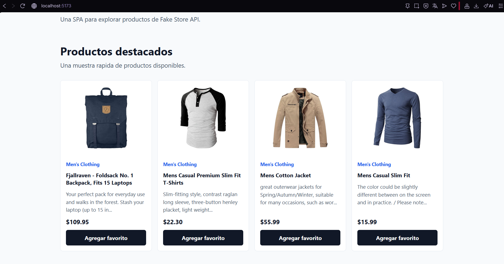

# fakestore-react

SPA creada con Vite, React 19 y TypeScript para consumir productos desde Fake Store API.

Autor: Junior Cueva Fabian

## Tecnologias usadas

- React 19
- Vite
- TypeScript
- React Router
- Axios
- Shadcn UI
- Tailwind CSS
- LocalStorage
- Vercel

## Funcionalidades

- Rutas principales: Home, Productos y Contact.
- Consumo de API publica: `https://fakestoreapi.com/products`.
- Listado de productos con titulo, precio, imagen, categoria y descripcion corta.
- Productos destacados en Home.
- Favoritos guardados en localStorage.
- Notificaciones al agregar o quitar favoritos.
- Loader durante la carga de productos.

## Ejecutar el proyecto

Instalar dependencias:

```bash
npm install
```

Levantar servidor local:

```bash
npm run dev
```

Crear build de produccion:

```bash
npm run build
```

Previsualizar build:

```bash
npm run preview
```

## Rutas

- `/` Home
- `/entities` Productos
- `/contact` Contact

## Deploy

Enlace del deploy: pendiente

## Video

Enlace del video: pendiente

## Capturas




